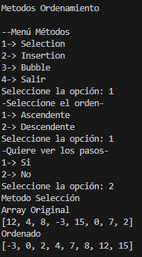
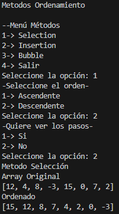
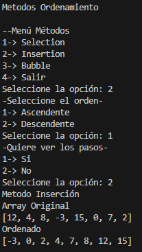
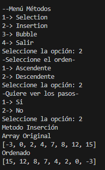
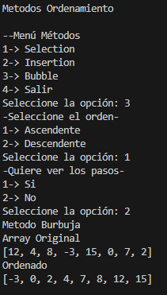
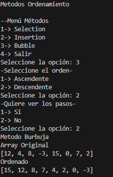

# Estructura de datos

**Estudiante:** Juan Naula

## Metodos Ordenamiento Practica

### Metodo Selection
Explicacion:
Selection sort selecciona el elemento mínimo (o máximo) del subarreglo restante y lo coloca en su posición correcta en cada iteración. Es simple y hace O(n^2) comparaciones.

Ascendente:

Descendente:

### Metodo Insertion
Explicacion:
Insertion inserta cada elemento en la posición adecuada dentro del prefijo ya ordenado; es eficiente para arreglos pequeños o casi ordenados (mejor caso O(n)).

Ascendente:

Descendente:

### Metodo Bubble 
Explicacion:
Bubble compara e intercambia pares adyacentes; la versión mejorada puede terminar antes si no se producen swaps en una pasada. Suele ser O(n^2).

Ascendente:

Descendente:

### Conclusion de la Practica

La práctica permitió implementar y observar el comportamiento de tres algoritmos de ordenamiento. Insertion destaca en arreglos casi ordenados; Selection es útil por su simplicidad y número reducido de swaps; Bubble es intuitivo pero menos eficiente, aunque su variante mejorada puede ahorrar trabajo en casos favorables.

